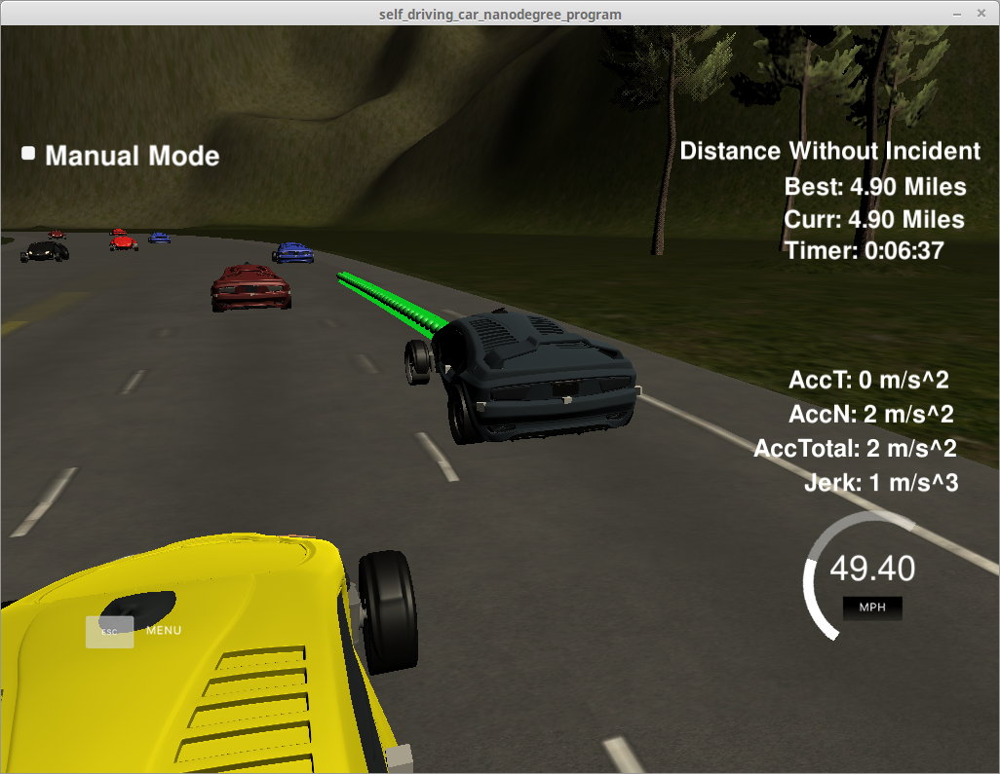

# CarND-Path-Planning-Project

## Instrucktions
   
 The goal of this project is to navigate a car around a simulated highway scenario, including traffic and given waypoint, telemetry, and sensor fusion data. The car must not violate a set of motion constraints, namely maximum velocity, maximum acceleration, and maximum jerk, while also avoiding collisions with other vehicles, keeping to within a highway lane (aside from short periods of time while changing lanes), and changing lanes when doing so is necessary to maintain a speed near the posted speed limit.
 
 

   
### Simulator.
You can download the Term3 Simulator which contains the Path Planning Project from the [releases tab (https://github.com/udacity/self-driving-car-sim/releases).


## Basic Build Instructions

1. Clone this repo.
2. Make a build directory: `mkdir build && cd build`
3. Compile: `cmake .. && make`
4. Run it: `./path_planning`.


## Dependencies

* cmake >= 3.5
 * All OSes: [click here for installation instructions](https://cmake.org/install/)
* make >= 4.1
  * Linux: make is installed by default on most Linux distros
  * Mac: [install Xcode command line tools to get make](https://developer.apple.com/xcode/features/)
  * Windows: [Click here for installation instructions](http://gnuwin32.sourceforge.net/packages/make.htm)
* gcc/g++ >= 5.4
  * Linux: gcc / g++ is installed by default on most Linux distros
  * Mac: same deal as make - [install Xcode command line tools]((https://developer.apple.com/xcode/features/)
  * Windows: recommend using [MinGW](http://www.mingw.org/)
* [uWebSockets](https://github.com/uWebSockets/uWebSockets)
  * Run either `install-mac.sh` or `install-ubuntu.sh`.
  * If you install from source, checkout to commit `e94b6e1`, i.e.
    ```
    git clone https://github.com/uWebSockets/uWebSockets 
    cd uWebSockets
    git checkout e94b6e1
    ```

---
## Implementation 

### Goals
In this project your goal is to safely navigate around a virtual highway with other traffic that is driving +-10 MPH of the 50 MPH speed limit. You will be provided the car's localization and sensor fusion data, there is also a sparse map list of waypoints around the highway. The car should try to go as close as possible to the 50 MPH speed limit, which means passing slower traffic when possible, note that other cars will try to change lanes too. The car should avoid hitting other cars at all cost as well as driving inside of the marked road lanes at all times, unless going from one lane to another. The car should be able to make one complete loop around the 6946m highway. Since the car is trying to go 50 MPH, it should take a little over 5 minutes to complete 1 loop. Also the car should not experience total acceleration over 10 m/s2  and jerk that is greater than 10 m/s3.

This implementation is summarized in the following three steps

* Prediction : Analysing other cars positions.
* Behavior Planner: What should I do
* Trajectory: How can I do it

###Prediction
This part of the code deal with the telemetry and sensor fusion data. It intents to reason about the environment. In the case, we want to know three aspects of it:

* Is there a car in front of us blocking the traffic.
* Is there a car to the right of us making a lane change not safe.
* Is there a car to the left of us making a lane change not safe.

These questions are answered by calculating the lane each other car is and the position it will be at the end of the last plan trajectory. A car is considered "dangerous" when its distance to our car is less than 30 meters in front or behind us.

This part decides what to do:

### Behavior

If we have a car in front of us, do we change lanes? Do we speed up or slow down? The prime directive is: Stay on the middle track if you can.
Based on the prediction of the situation we are in, this code increases the speed, decrease speed, or make a lane change when it is safe: 

* If a other car ahead and there is no other car left and there is a left Change lane to the left. 
* If a other car ahead and there is no other car right and there is a right lane. Change lane to the right.
* if there is no car ahead and I am on left line and there is no other car on the right. Go back to center.
* if there is no car ahead and I am on righ line Back to center.

 Instead of increasing the speed at this part of the code, a speed_diff is created to be used for speed changes when generating the trajectory in the last part of the code. This approach makes the car more responsive acting faster to changing situations like a car in front of it trying to apply breaks to cause a collision.

### Trajectory 
This code does the calculation of the trajectory based on the speed and lane output from the behavior, car coordinates and past path points.

First, the last two points of the previous trajectory (or the car position if there are no previous trajectory) are used in conjunction three points at a far distance  to initialize the spline calculation). To make the work less complicated to the spline calculation based on those points, the coordinates are transformed (shift and rotation) to local car coordinates .

In order to ensure more continuity on the trajectory (in addition to adding the last two point of the pass trajectory to the spline adjustment), the pass trajectory points are copied to the new trajectory . The rest of the points are calculated by evaluating the spline and transforming the output coordinates to not local coordinates . Worth noticing the change in the velocity of the car from line 393 to 398. The speed change is decided on the behavior part of the code, but it is used in that part to increase/decrease speed on every trajectory points instead of doing it for the complete trajectory.

## Result

* The car is able to drive at least 4.32 miles without incident.
* The car drives according to the speed limit.
* Max Acceleration and Jerk are not Exceeded.
* Car does not have collisions.
* The car stays in its lane, except for the time between changing lanes.
* The car is able to change lanes

[](https://www.youtube.com/watch?v=woE94bnccno)


## Reflektion 

The car speed is sometimes swinging appreciable. It would be nice to use a better speed controller for example a PID Controler.